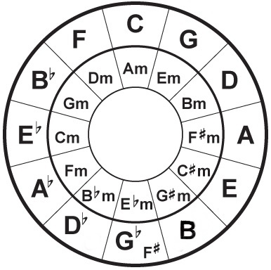

```{r setup, include=FALSE}
knitr::opts_chunk$set(echo = TRUE, fig.align = 'center',
                      warning = FALSE, message = FALSE, 
                      eval = FALSE, cache = TRUE)
library(tidyverse)
```

class: middle

Esta apresentação pode ser acessada em: http://brunaw.com/shortcourses/IXSER/pt-br/pres-pt-br.html

**GitHub**:
https://github.com/brunaw/SER2019

---

# Quem somos

.pull-left[
```{r, echo = FALSE, out.width="70%", eval = TRUE}

```
] .pull-right[
**Bruna Wundervald**
- Doutoranda em Estatística na Maynooth University.
- Twitter: @bwundervald
- GitHub: @brunaw
]

---
# Quem somos

.pull-left[
```{r, echo = FALSE, out.width="70%", eval = TRUE}

```
].pull-right[
  **Julio Trecenti**
  - Doutorando em Estatística no IME-USP
  - Sócio da Curso-R
  - Twitter: @jtrecenti
  - GitHub: @jtrecenti

  ]

---
# Objetivos

  - Aprender a utilizar os pacotes:
    - `vagalumeR`: extração de letras
    - `chorrrds`: extração de acordes 
    - `Rspotify`: extração de variáveis da [API do Spotify](https://developer.spotify.com/documentation/web-api/)
    
  - Entender como funciona a acesso a APIs em geral.
  - Conectar dados de diferentes fontes.
  - Compreender e resumir dados de diferentes formatos:
    - Texto
    - Contínuos
    - Sequências
  - Aprender a criar e interpretar um modelo de predição simples. 

**Não abordado neste curso:** análise de áudio. 

---
# Requisitos & recursos

   - `R` iniciante/intermediário 
   - `tidyverse`
   - `%>%` (pipe) é essencial! 
    
[**R-Music Blog**](https://r-music.rbind.io/) 

<h4 style="padding:0px;margin:10px;">
R para extração & análise de dados musicais
</h4>

---

# Não se perca!

- Se você travar em alguma parte, não hesite em nos chamar
- Tenha ao seu lado as Cheatsheets da RStudio:

https://www.rstudio.com/resources/cheatsheets/

- Se precisar de um material em português, veja o site da Curso-R:

https://curso-r.com/material/

---

# Carregando pacotes

Principais: 
```{r, eval = FALSE}
library(vagalumeR)
library(Rspotify)
library(chorrrds)
library(tidyverse)
```

---
class: bottom, center, inverse

# Extração de dados
## `vagalumeR`: letras de músicas 
## `RSpotify`: variáveis do Spotify
## `chorrrds`: acordes das músicas

---
# Extração de dados

- Para cada pacote, existe um fluxo a ser seguido.

- O fluxo envolve, basicamente, 
  1. obter os IDs dos objetos dos quais queremos as informações (como artistas, álbuns, músicas), e 
  2. passar estes IDs para funções específicas;

---
# Conectando às APIs
## `vagalumeR`
Passos:
  1. Entrar em [`https://auth.vagalume.com.br/`](https://auth.vagalume.com.br/) e logar,
  2. Entrar em [`https://auth.vagalume.com.br/settings/api/`](https://auth.vagalume.com.br/settings/api/) e criar um 
  aplicativo,
  3. Entrar em [`https://auth.vagalume.com.br/settings/api/`](https://auth.vagalume.com.br/settings/api/) novamente 
  e copiar a credencial do aplicativo. 
  4. Salvar a credencial em um objeto, como:
  
```{r, eval = FALSE}
key_vagalume <- "minha-credencial"
```

---
# Conectando às APIs
## `Rspotify`

Passos:
  1. Entrar em [`https://developer.spotify.com/`](https://developer.spotify.com/) e logar, 
  2. Entrar em [`https://developer.spotify.com/dashboard/`](https://developer.spotify.com/dashboard/) e criar um 
  aplicativo,
  3. Salvar o **client ID** e o **client Secret** gerados, 
  4. Definir a como URL de redirecionamento como `http://localhost:1410/`,
  5. Usar a função `spotifyOAuth()` para autenticar o acesso:
  
```{r, eval = FALSE}
library(Rspotify)
key_spotify <- spotifyOAuth("app_id","client_id","client_secret")
```
  
> As chaves serão usadas posteriormente para nos dar acesso aos
dados provenientes das duas APIs.

---

## `vagalumeR`

```{r, eval = FALSE}
# 1. Definir artista
artist <- "chico-buarque"

# 2. Buscar os nomes e IDS das músicas de um artista
songs <- artist %>% 
  purrr::map_dfr(songNames)

# 3. Mapear a função que traz as letras nos IDs encontrados  
lyrics <-  songs %>% 
  dplyr::pull(song.id) %>% 
  purrr::map(lyrics, 
             artist = artist,
             type = "id", 
             key = key_vagalume) %>%
  purrr::map_dfr(data.frame) %>% 
  dplyr::select(-song) %>% 
  dplyr::right_join(songs %>% 
                      dplyr::select(song, song.id), by = "song.id")
```

---

## `RSpotify` - variáveis


- “danceability” = o quão dançável uma música é, combinando elementos como tempo, batidas e regularidade.
- “energy” = uma medida entre 0.0 e 1.0 representando a intensidade e atividade.
- “key_spotify” = escala estimada da música. São valores inteiros mapeados na notação musical.  E.g. 0 = C, 1 = C#/Db 2 = D, e assim por diante.
- “loudness” = altura da música em decibéis (dB).
- “mode” = modalidade (maior ou menor), da escala da qual a música é derivada.
- “speechiness” = detect a presença de palavras faladas.
- “acousticness” = o quanto a música é acústica.
- “instrumentalness” = se a música contém vocais. 
- “liveness” = presença de audiência na gravação. 
- “valence” = a "positividade" musical medida entre 0 e 1.
- “tempo” = tempo estimado em batidas por minuto (BPM).
- “duration_ms” = duração da música em milisegundos. 
- “time_signature” = indica quantas batidas existem por compasso. 
- "popularity"  = a popularidade de cada música.

---

## `RSpotify`

```{r, eval = FALSE}
# 1. "Buscar" o artist usando a API
find_artist <- searchArtist("chico buarque", token = key_spotify)

# 2. Usar o ID encontrado para buscar informações dos albuns
albums <- getAlbums(find_artist$id[1], token = key_spotify)

# 3. Obter as músicas de cada albúm
albums_res <- albums %>% 
  dplyr::pull(id) %>% 
  purrr::map_df(
    ~{
      getAlbum(.x, token = key_spotify) %>% 
        dplyr::select(id, name) 
    }) %>% 
  tidyr::unnest()

ids <- albums_res %>% 
  dplyr::pull(id)

# 4. Obter as variáveis para cada música
features <- ids %>% 
  purrr::map_dfr(~getFeatures(.x, token = key_spotify)) %>% 
  dplyr::left_join(albums_res, by = "id")
```

---

**O pacote ainda não tem uma opção simples para encontrar a popularidade das músicas. Como resolver?**
```{r, eval = FALSE}
# 5. Criar uma função simples para pegar a popularidade
getPop <- function(id, token){
  u <- paste0("https://api.spotify.com/v1/tracks/", id)
  req <- httr::GET(u, httr::config(token = token))
  json1 <- httr::content(req)
  res <- data.frame(song = json1$name, 
                    popul = json1$popularity, 
                    id = json1$id)
  return(res)
}

# 6. Mapear essa função nos IDs das músicas
popul <-  features %>% 
  dplyr::pull(id) %>% 
  purrr::map_dfr(~getPop(.x, token = key_spotify)) 

# 7. Juntar a popularidade com o resto das variáveis 
features <- features %>% 
  dplyr::right_join(
    popul %>% dplyr::select(-song), 
    by = c("id" = "id"))
```

---
# Detalhes sobre APIs

- ** Elas podem ser muito instáveis. Isso significa que algumas vezes, mesmo sem atingir o limite de consultas máximo, elas vão falhar.**

Como resolver? 

  - Dividir o processo em consultas menores
  - Colocar um pequeno intervalo de tempo entre as consultas, com
  `Sys.sleep()` por exemplo 
  
---

# `chorrrds`

```{r, eval = FALSE}
# 1. Buscar as músicas
songs <- "chico-buarque" %>% 
  chorrrds::get_songs() 

# 2. Mapear a extração de acordes nas músicas encontradas
chords <- songs %>% 
  dplyr::pull(url) %>%                     
  purrr::map(chorrrds::get_chords) %>%    
  purrr::map_dfr(dplyr::mutate_if, is.factor, as.character) %>% 
  chorrrds::clean(message = FALSE) 
```


---

# Combinando as bases

```{r, eval = FALSE}
# Padronizar o nome da coluna chave e usar uma função de união, 
# como o inner_join()

chords <- chords %>% 
  dplyr::mutate(song = stringr::str_remove(music, "chico buarque ")) %>% 
  dplyr::select(-music)

lyrics <- lyrics %>% 
  dplyr::mutate(song = stringr::str_to_lower(song))

features <- features %>% 
  dplyr::mutate(song = stringr::str_to_lower(name)) %>% 
  dplyr::select(-name)

all_data <- chords %>% 
  dplyr::inner_join(lyrics, by = "song") %>% 
  dplyr::inner_join(features, by = "song")

```

---
**E se tiver muita coisa que não deu match?**

```{r, eval = FALSE}
nrow(chords) - nrow(all_data) 
#> 8973
```

--

- Resolver esses casos manualmente pode dar muito trabalho.
- Uma forma de resolver automaticamente é calculando as similaridades entre os nomes.
- Podemos fazer isso medindo a distância entre os nomes é verificando se um nome é igual ao outro a menos de uma, duas ou três letras. Por exemplo:

```{r, eval = TRUE}
nome1 <- "Geni e o Zepelim"
nome2 <- "Geni e o Zepelin"
# Calcula a distância
RecordLinkage::levenshteinDist(nome1, nome2)
# Calcula a similaridade = 1 -  dist / str_length(maior_nome)
RecordLinkage::levenshteinSim(nome1, nome2)
```

- Quando os nomes são diferentes, pegamos o nome que tem maior similaridade.
- Às vezes não existe um match, então é bom escolher um valor de corte (arbitrário) para a similaridade.

---

# Arrumando os nomes

```{r, eval = FALSE}
# Vamos arrumar algumas linhas avaliando as distâncias
# entre os nomes das músicas

# 1. O que tem em acordes que nao tem em letras?
anti_chords_lyrics <- chords %>% 
  dplyr::anti_join(lyrics, by = "song") 

# 2. Salvando os nomes para corrigir
names_to_fix <- anti_chords_lyrics %>% 
  dplyr::distinct(song) %>% 
  dplyr::pull(song)

# 3. Calculando as 'distâncias' entre as músicas 
# da base de letras e as que deram
# unmatch na base de acordes
dists <- lyrics$song %>% 
  purrr::map(RecordLinkage::levenshteinSim, str1 = names_to_fix)

```

---

```{r, eval = FALSE}
# 4. Encontrando os nomes de músicas mais similares nas duas bases
ordered_dists <- dists %>% purrr::map_dbl(max)
max_dists <- dists %>% purrr::map_dbl(which.max)

# 5. Filtrando as que tem similaridade > 0.70
indexes_min_dist <- which(ordered_dists > 0.70)
songs_min_dist <- lyrics$song[indexes_min_dist]
index_lyrics <- max_dists[which(ordered_dists > 0.70)]

# 6. Salvando as mais similares em um data.frame 
results_dist_lyrics <- data.frame(from_chords = names_to_fix[index_lyrics],
                                  from_lyrics = songs_min_dist)

```

**Exemplos de casos muito similares encontrados:**

*a bela a fera*  **e** *a bela e a fera*, 

*logo eu* **e** *logo eu?*, 

*não fala de maria* **e** *não fala de maria*,

... 

--

Agora sobraram menos problemas; vamos arrumá-los manualmente.

---

## Arrumando manualmente

```{r, eval = FALSE}
chords <- chords %>% 
  dplyr::mutate(
    song = 
      dplyr::case_when( 
        song == 'a bela a fera' ~ 'a bela e a fera',  
        song == 'a historia de lily braun' ~ 'a história de lily braun',  
        song == 'a moca do sonho' ~ 'a moça do sonho',  
        song == 'a ostra o vento' ~ 'a ostra e o vento',  
        song == 'a televisao' ~ 'a televisão',  
        song == 'a valsa dos clows' ~ 'a valsa dos clowns',  
        song == 'a voz do dono o dono da voz' ~ 'a voz do dono e o dono da voz',  
        song == 'agora falando serio' ~ 'agora falando sério',  
        TRUE ~ song))

```

--

Dica: Como criar a sintaxe anterior facilmente: 

```{r, eval = FALSE}
cat(
  paste0("song == ", "'", results_dist_lyrics$from_chords, "' ~ '", 
         results_dist_lyrics$from_lyrics, "', "), collapse = "")

```

> Link para os dados: https://github.com/brunaw/SER2019/tree/master/shortcourse/data/all_data.txt

---

# Refazendo os `joins`

```{r}
all_data <- chords %>% 
  dplyr::inner_join(lyrics, by = "song") %>% 
  dplyr::inner_join(features, by = "song")

# Finalmente salvando os dados!
write.table(all_data, "all_data.txt")
```

---

class: bottom, center, inverse

# Análise Exploratória

---

# Parte 1: letras

Pacotes extra:
  - `tm`: análise de texto em geral
  - `tidytext`: análise de texto `tidy`
  - `lexiconPT`: dicionário de sentimentos em português
  

```{r, echo = FALSE, eval = TRUE}
all_data <- read.table("shortcourse/data/all_data.txt", 
                       stringsAsFactors = FALSE)
```

---

# n-grams

**n-grams**: as palavras e seus passados

- útil na análise de expressões mais complexas ou sequências

```{r, eval = TRUE}
nome1 <- "Geni e o Zepelim"
tokenizers::tokenize_ngrams(nome1, n = 1)
tokenizers::tokenize_ngrams(nome1, n = 2)
tokenizers::tokenize_ngrams(nome1, n = 3)
```

---

# n-grams

- a função `unnest_tokens()` separa e empilha os n-gramas de cada letra.

```{r, eval = TRUE}
library(tidytext)
library(wordcloud)

# Lista de stopwords em português
stopwords_pt <- data.frame(word = tm::stopwords("portuguese"))

# Quebrando as frases em palavras 
unnested <- all_data %>% 
  select(text) %>% 
  unnest_tokens(word, text, token = "ngrams", n = 1) %>% 
  # Removendo stopwords
  dplyr::anti_join(stopwords_pt, by = c("word" = "word"))
```

*stopwords*: palavras que ocorrem com muito frequência e podem não ser essenciais para o significado de uma frase
---

# Parte 1: letras

Contando cada palavra que apareceu nas letras: 
```{r, eval = TRUE}
unnested %>% 
  dplyr::count(word) %>% 
  arrange(desc(n)) %>% 
  slice(1:10)
```

---

# 1-grams 

```{r, eval = FALSE}
unnested %>% 
  dplyr::count(word) %>% 
  # tirar palavras que aparecem pouco
  dplyr::filter(n < quantile(n, 0.999)) %>%
  dplyr::top_n(n = 30) %>% 
  ggplot(aes(reorder(word, n), n)) +
  geom_linerange(aes(ymin = min(n), ymax = n, x = reorder(word, n)),
                 position = position_dodge(width = 0.2), size = 1, 
                 colour = 'darksalmon') + 
  geom_point(colour = 'dodgerblue4', size = 3, alpha = 0.9) +
  coord_flip() +
  labs(x = 'Top 30 palavras mais comuns', y = 'Contagem') +
  theme_bw(14)
```


---

```{r, fig.width=5.5, fig.height=6, echo = FALSE, eval = TRUE}
unnested %>% 
  dplyr::count(word) %>% 
  dplyr::filter(n < quantile(n, 0.999)) %>% 
  dplyr::top_n(n = 30) %>% 
  ggplot(aes(reorder(word, n), n)) +
  geom_linerange(aes(ymin = min(n), ymax = n, x = reorder(word, n)),
                 position = position_dodge(width = 0.2), size = 1, 
                 colour = 'darksalmon') + 
  geom_point(colour = 'dodgerblue4', size = 3, alpha = 0.9) +
  coord_flip() +
  labs(x = 'Top 30 palavras mais comuns', y = 'Contagem') +
  theme_bw(14)
```

---
# Em formato de `wordcloud`

```{r, eval = TRUE, fig.width=5, fig.height=5, fig.align="center"}
unnested %>% 
  count(word) %>% 
  with(wordcloud(word, n, family = "serif", 
                 random.order = FALSE, max.words = 30, 
                 colors = c("darksalmon", "dodgerblue4")))
```


---

# 2-grams 

```{r, eval = FALSE}
all_data %>% 
  select(text) %>% 
  unnest_tokens(bigram, text, token = "ngrams", n = 2) %>%
  separate(bigram, c("word1", "word2"), sep = " ") %>%
  filter(!word1 %in% stopwords_pt$word, 
         !is.na(word1), !is.na(word2),
         !word2 %in% stopwords_pt$word) %>%
  count(word1, word2, sort = TRUE) %>% 
  mutate(word = paste(word1, word2)) %>% 
  filter(n < quantile(n, 0.999)) %>% 
  arrange(desc(n)) %>% 
  slice(1:30) %>%  
  ggplot(aes(reorder(word, n), n)) +
  geom_linerange(aes(ymin = min(n), ymax = n, x = reorder(word, n)),
                 position = position_dodge(width = 0.2), size = 1, 
                 colour = 'darksalmon') + 
  geom_point(colour = 'dodgerblue4', size = 3, alpha = 0.9) +
  coord_flip() +
  labs(x = 'Top 30 2-grams mais comuns', y = 'Contagem') +
  theme_bw(14)
```


---

```{r, eval = TRUE, echo = FALSE}
all_data %>% 
  select(text) %>% 
  unnest_tokens(bigram, text, token = "ngrams", n = 2) %>%
  separate(bigram, c("word1", "word2"), sep = " ") %>%
  filter(!word1 %in% stopwords_pt$word, 
         !is.na(word1), !is.na(word2),
         !word2 %in% stopwords_pt$word) %>%
  count(word1, word2, sort = TRUE) %>% 
  mutate(word = paste(word1, word2)) %>% 
  filter(n < quantile(n, 0.999)) %>% 
  arrange(desc(n)) %>% 
  slice(1:30) %>%  
  ggplot(aes(reorder(word, n), n)) +
  geom_linerange(aes(ymin = min(n), ymax = n, x = reorder(word, n)),
                 position = position_dodge(width = 0.2), size = 1, 
                 colour = 'darksalmon') + 
  geom_point(colour = 'dodgerblue4', size = 3, alpha = 0.9) +
  coord_flip() +
  labs(x = 'Top 30 2-grams mais comuns', y = 'Contagem') +
  theme_bw(14)


```

---

# Análise de sentimentos

```{r, eval = TRUE}
# devtools::install_github("sillasgonzaga/lexiconPT")

# Buscando os sentimentos do pacote lexiconPT
sentiments_pt <- lexiconPT::oplexicon_v2.1 %>% 
  mutate(word = term) %>% 
  select(word, polarity)  

# Juntando os sentimentos com as palavras presentes nas músicas
add_sentiments <- all_data %>% 
  select(text, song) %>% 
  group_by_all() %>% 
  slice(1) %>% 
  ungroup() %>% 
  unnest_tokens(word, text) %>% 
  dplyr::anti_join(stopwords_pt, by = c("word" = "word")) %>% 
  dplyr::inner_join(sentiments_pt, by = c("word" = "word")) 
```

---

```{r}
add_sentiments %>% 
  group_by(polarity) %>% 
  count(word) %>% 
  filter(n < quantile(n, 0.999)) %>% 
  top_n(n = 15) %>% 
  ggplot(aes(reorder(word, n), n)) +
  geom_linerange(aes(ymin = min(n), ymax = n, x = reorder(word, n)),
                 position = position_dodge(width = 0.2), size = 1, 
                 colour = 'darksalmon') + 
  geom_point(colour = 'dodgerblue4', size = 3, alpha = 0.9) +
  facet_wrap(~polarity, scales = "free") +
  coord_flip() +
    labs(x = 'Top 15 palavras mais comuns', 
       y = 'Contagens', title = "Sentimentos") +
  theme_bw(14)
```


---
class:  center

```{r, echo = FALSE, eval = TRUE, fig.width=8, fig.height=6}
add_sentiments %>% 
  group_by(polarity) %>% 
  count(word) %>% 
  filter(n < quantile(n, 0.999)) %>% 
  top_n(n = 15) %>% 
  ggplot(aes(reorder(word, n), n)) +
  geom_linerange(aes(ymin = min(n), ymax = n, x = reorder(word, n)),
                 position = position_dodge(width = 0.2), size = 1, 
                 colour = 'darksalmon') + 
  geom_point(colour = 'dodgerblue4', size = 3, alpha = 0.9) +
  facet_wrap(~polarity, scales = "free") +
  coord_flip() +
  labs(x = 'Top 15 palavras mais comuns', 
       y = 'Contagens', title = "Sentimentos") +
  theme_bw(14)

```

---

# Quais são as músicas mais negativas e mais positivas?

```{r}
summ <- add_sentiments %>% 
  group_by(song) %>% 
  summarise(mean_pol = mean(polarity)) 

# 15 músicas mais negativas e mais positivas
summ %>% 
  arrange(desc(mean_pol)) %>% 
  slice(c(1:15, 121:135)) %>% 
  mutate(situation = rep(c('+positivas', '+negativas'), each = 15)) %>% 
  ggplot(aes(reorder(song, mean_pol), mean_pol)) +
  geom_linerange(aes(ymin = min(mean_pol), ymax = mean_pol, 
                     x = reorder(song, mean_pol)),
                 position = position_dodge(width = 0.2), size = 1, 
                 colour = 'darksalmon') + 
  geom_point(colour = 'dodgerblue4', size = 3, alpha = 0.9) +
  facet_wrap(~situation, scales = "free") +
  coord_flip() +
  labs(x = 'Músicas', y = 'Polaridades') +
  theme_bw(14)
```

---

--- 

```{r, eval = TRUE, echo = FALSE, fig.width=8, fig.height=6}
summ <- add_sentiments %>% 
  group_by(song) %>% 
  summarise(mean_pol = mean(polarity)) 

summ %>% 
  arrange(desc(mean_pol)) %>% 
  slice(c(1:15, 121:135)) %>% 
  mutate(situation = rep(c('+positivas', '+negativas'), each = 15)) %>% 
  ggplot(aes(reorder(song, mean_pol), mean_pol)) +
  geom_linerange(aes(ymin = min(mean_pol), ymax = mean_pol, 
                     x = reorder(song, mean_pol)),
                 position = position_dodge(width = 0.2), size = 1, 
                 colour = 'darksalmon') + 
  geom_point(colour = 'dodgerblue4', size = 3, alpha = 0.9) +
  facet_wrap(~situation, scales = "free") +
  coord_flip() +
  labs(x = 'Músicas', y = 'Polaridades') +
  theme_bw(14)
```


---
class: middle
## O que sabemos até agora?

  - As palavras e bi-gramas mais comuns 
  - Existem mais palavras positivas do que negativas nas letras em geral
  - Em quais músicas estão as palavras mais positivas e as mais negativas


---

# Parte 2. Acordes

Pacotes extra:
  - `ggridges`: gráficos de densidades
  - `chorddiag`: diagramas de cordas

```{r}
# Removendo enarmonias
chords <- all_data %>%
  select(chord, song) %>% 
  dplyr::mutate(chord = case_when( 
    chord == "Gb" ~ "F#",
    chord == "C#" ~ "Db",          
    chord == "G#" ~ "Ab",
    chord == "A#" ~ "Bb",
    chord == "D#" ~ "Eb",
    chord == "E#" ~ "F",
    chord == "B#" ~ "C",
    TRUE ~ chord)) 
```

---

# Parte 2. Acordes

```{r}
# Top 20 músicas com uma maior quantidade de acordes distintos
chords %>% 
  dplyr::group_by(song, chord) %>% 
  dplyr::summarise(distintos = n_distinct(chord)) %>% 
  dplyr::summarise(cont = n()) %>% 
  dplyr::mutate(song = fct_reorder(song, cont)) %>% 
  top_n(n = 20) %>% 
  ggplot(aes(y = cont, x = song)) +
  geom_bar(colour = 'dodgerblue4', fill = 'darksalmon',
           size = 0.5, alpha = 0.6, stat = "identity") +
  labs(x = 'Músicas', y = 'Contagem de Acordes Distintos') +
  coord_flip() +
  theme_bw(14)
```

---

```{r, echo = FALSE, eval = TRUE}
# Removendo enarmonias
chords <- all_data %>%
  select(chord, song) %>% 
  dplyr::mutate(chord = case_when( 
    chord == "Gb" ~ "F#",
    chord == "C#" ~ "Db",          
    chord == "G#" ~ "Ab",
    chord == "A#" ~ "Bb",
    chord == "D#" ~ "Eb",
    chord == "E#" ~ "F",
    chord == "B#" ~ "C",
    TRUE ~ chord)) 

# Top 20 músicas com uma maior quantidade de acordes
chords %>% 
  dplyr::group_by(song, chord) %>% 
  dplyr::summarise(distintos = n_distinct(chord)) %>% 
  dplyr::summarise(cont = n()) %>% 
  dplyr::mutate(song = fct_reorder(song, cont)) %>% 
  top_n(n = 20) %>% 
  ggplot(aes(y = cont, x = song)) +
  geom_bar(colour = 'dodgerblue4', fill = 'darksalmon',
           size = 0.5, alpha = 0.6, stat = "identity") +
  labs(x = 'Músicas', y = 'Contagem de Acordes Distintos') +
  coord_flip() +
  theme_bw(14)

```

---
# Extraindo variáveis

- Os acordes são, no fundo, um pedaço de texto. 
- Textos no estado "cru" não são muito informativos. 

Vamos usar a função `feature_extraction()` para extrair
covariáveis relacionadas aos acordes que tenham 
uma interpretação clara: 

- Acordes menores
- Acordes diminutos
- Acordes aumentados
- Sus 
- Com a sétima nota
- Com a sétima nota maior
- Com a sexta nota
- Com a quarta nota
- Com a quinta nota aumentada
- Com a quinta nota diminuta
- Com a nona nota
- Com baixo variante  

---
# Extraindo variáveis

```{r, eval = TRUE}
feat_chords <- all_data %>%
  select(chord, song) %>% 
  chorrrds::feature_extraction() %>% 
  select(-chord) %>% 
  group_by(song) %>% 
  summarise_all(mean)

dt <- feat_chords %>% 
  tidyr::gather(group, vars, minor, seventh, 
                seventh_M, sixth, fifth_dim, fifth_aug, 
                fourth, ninth, bass, dimi, augm)
```


---
# Extraindo variáveis 

```{r, eval = TRUE}
dplyr::glimpse(feat_chords)
```

---
# Visualizando

```{r}
library(ggridges)

dt$group <- forcats::lvls_revalue(
  dt$group,
  c("Aumentado", "Baixo", "Diminuto", 
    "Quinta Aum.", "Quinta Dim.", 
    "Quarta", "Menor", "Nona", "Sétima",
    "Sétima Maior", "Sexta"))

# Plotando as densidades das variáveis extraídas

dt %>% 
  ggplot(aes(vars, group, fill = group)) +
  geom_density_ridges(alpha = 0.6) +
  scale_fill_cyclical(values = c("dodgerblue4", "darksalmon")) +
  guides(fill = FALSE) +
  xlim(0, 1) +
  labs(x = "Densidades", y = "Variáveis extraídas") +
  theme_bw(14)

```

---

```{r, eval = TRUE, echo = FALSE}
library(ggridges)

dt$group <- forcats::lvls_revalue(
  dt$group,
  c("Aumentado", "Baixo", "Diminuto", 
    "Quinta Aum.", "Quinta Dim.", 
    "Quarta", "Menor", "Nona", "Sétima",
    "Sétima Maior", "Sexta"))

# Plotando as densidades das variáveis extraídas
dt %>% 
  ggplot(aes(vars, group, fill = group)) +
  geom_density_ridges(alpha = 0.6) +
  scale_fill_cyclical(values = c("dodgerblue4", "darksalmon")) +
  guides(fill = FALSE) +
  xlim(0, 1) +
  labs(x = "Densidades",  y = "Variáveis extraídas") +
  theme_bw(14)

```

---

# Diagramas de cordas

As transições entre os acordes são um elemento importante da 
estrutura harmônica de músicas. Vamos avaliar como estas transições
se dão neste caso.

```{r}
# devtools::install_github("mattflor/chorddiag")
# Contando as transições entre os acordes
comp <- chords %>% 
  dplyr::mutate(
    # Colocando os acordes na forma mais simples
    chord_clean = stringr::str_extract(chord, pattern = "^([A-G]#?b?)"),
    seq = lead(chord_clean)) %>% 
  dplyr::filter(chord_clean != seq) %>% 
  dplyr::group_by(chord_clean, seq) %>%  
  dplyr::summarise(n = n())

mat <- tidyr::spread(comp, key = chord_clean, value = n, fill = 0)  
mm <- as.matrix(mat[, -1]) 

# Construindo o diagrama
chorddiag::chorddiag(mm, showTicks = FALSE, palette = "Blues")

```


---

# Expressões regulares (regex)

- Mini-linguagem usada para representar textos
- Para quem trabalha com texto, é indispensável saber regex
- Regex são usadas dentro do pacote `stringr`
- Para se aprofundar em regex:
    - [Slides sobre regex](https://ctlente.com/pt/teaching/stringr-lubridate/)
    - [Material online](https://www.curso-r.com/material/stringr/)
    - [Cheat Sheet](https://github.com/rstudio/cheatsheets/raw/master/strings.pdf)
    

---

# Diagramas de cordas

```{r, eval = TRUE, echo = FALSE, fig.align="center", out.width="100%"}
# Contando as transições entre os acordes
comp <- chords %>% 
  dplyr::mutate(
    # Colocando os acordes na forma mais simples
    chord_clean = stringr::str_extract(chord, pattern = "^([A-G]#?b?)"),
    seq = lead(chord_clean)) %>% 
  dplyr::filter(chord_clean != seq) %>% 
  dplyr::group_by(chord_clean, seq) %>%  
  dplyr::summarise(n = n())

mat <- tidyr::spread(comp, key = chord_clean, value = n, fill = 0)  
mm <- as.matrix(mat[, -1]) 

# Construindo o diagrama
chorddiag::chorddiag(mm, showTicks = FALSE,
                     palette = "Blues")

```

---

# O círculo das quintas

- Nos permite entender quais os campos harmônicos mais prováveis

```{r, eval = TRUE, echo = FALSE}

```


---
class: middle
## O que sabemos até agora?

  - Algumas músicas são harmonicamente mais "complexas" que outras:
    - quantidades de acordes distintos
    - variáveis extraídas
  - As transições de acordes mais e menos frequentes


---

# Parte 3. Variáveis do Spotify

## Explorando as variáveis

```{r}
spot <- all_data %>% 
  group_by(song) %>% 
  slice(1) %>% 
  ungroup()

# Densidade da popularidade das músicas
spot %>% 
  ggplot(aes(popul)) +
  geom_density(colour = 'dodgerblue4', fill = "darksalmon", 
               alpha = 0.8) +
  labs(x = "Popularidade", y = "Densidade") +
  theme_bw(18)
```

---

```{r, eval = TRUE, echo = FALSE}
spot <- all_data %>% 
  group_by(song) %>% 
  slice(1) %>% 
  ungroup()

# Densidade da popularidade das músicas
spot %>% 
  ggplot(aes(popul)) +
  geom_density(colour = 'dodgerblue4',
               fill = "darksalmon", 
               alpha = 0.8) +
  labs(x = "Popularidade", y = "Densidade") +
  theme_bw(18)
```

Varia bastante!

---

# Músicas mais e menos populares

```{r}
spot %>% 
  arrange(desc(popul)) %>%  
  slice(c(1:15, 121:135)) %>% 
  mutate(situation = rep(c('+popul', '-popul'), each = 15)) %>% 
  select(popul, situation, song) %>% 
  ggplot(aes(reorder(song, popul), popul, group = 1)) +
  geom_bar(colour = 'dodgerblue4',  fill = "darksalmon", 
           size = 0.3, alpha = 0.6, 
           stat = "identity") +
  facet_wrap(~situation, scales = "free") +
  coord_flip() +
  labs(x = 'Músicas', y = 'Popularidade') +
  theme_bw(14)
```

---


```{r, eval = TRUE, echo = FALSE, fig.width=8, fig.height=6}
spot %>% 
  arrange(desc(popul)) %>%  
  slice(c(1:15, 121:135)) %>% 
  mutate(situation = rep(c('+popul', '-popul'), each = 15)) %>% 
  select(popul, situation, song) %>% 
  ggplot(aes(reorder(song, popul), popul, group = 1)) +
  geom_bar(colour = 'dodgerblue4',  fill = "darksalmon", 
           size = 0.3, alpha = 0.6, 
           stat = "identity") +
  facet_wrap(~situation, scales = "free") +
  coord_flip() +
  labs(x = "Dançabilidade", y = "Variáveis") +
  theme_bw(14)

```

---

# Dançabilidade `x` as outras variáveis

```{r}
dt <- spot %>% 
  select(energy, loudness, speechiness, liveness, 
         duration_ms, acousticness) %>% 
  tidyr::gather(group, vars) 

dt$danceability <- spot$danceability

dt %>% 
ggplot(aes(danceability, vars)) +
  geom_point(colour = "darksalmon") +  
  geom_smooth(method  = "lm", colour = "dodgerblue4") +
  labs(x = "Dançabilidade", y = "Variáveis") +
  facet_wrap(~group, scales = "free") +
  theme_bw(14)

```

---
class: center

```{r, eval = TRUE, echo = FALSE, fig.width=8, fig.height=7}
dt <- spot %>% 
  select(energy,  
          loudness, speechiness, liveness, duration_ms, 
          acousticness) %>% 
  tidyr::gather(group, vars) 

dt$danceability <- spot$danceability

dt %>% 
  ggplot(aes(danceability, vars)) +
  geom_point(colour = "darksalmon") +  
  geom_smooth(method  = "lm", colour = "dodgerblue4") +
  labs(x = "Dançabilidade", y = "Variáveis") +
  facet_wrap(~group, scales = "free") +
  theme_bw(14)

```

---
class: middle
## O que sabemos até agora?

- Como a popularidade varia nos dados 
- Quais são as músicas mais e menos populares
- Como é a relação da dançabilidade com as outras variáveis

---

class: bottom, center, inverse

# Modelagem

---

# Modelagem

Vamos considerar agora que temos um interesse especial na popularidade
das músicas. Quais variáveis seriam mais associadas com altos ou baixos
níveis de popularidade?

Para começar, transformamos a popularidade em uma variável
de 3 classes:

```{r, eval = TRUE}
library(randomForest)

spot <- spot %>% 
  mutate(pop_class = ifelse(
    popul < quantile(popul, 0.25), "pouco popular",
    ifelse(popul < quantile(popul, 0.55), "neutro", "popular")))

spot %>% 
  janitor::tabyl(pop_class)
```

---
**Arrumando os dados a fim de deixá-los prontos para a modelagem**

```{r, eval = TRUE}
# Unindo as bases anteriores e arrumando
set.seed(1)
model_data <- feat_chords %>% 
  right_join(spot, by = c("song" = "song")) %>% 
  right_join(summ, by = c("song" = "song")) %>% 
  select(-analysis_url, -uri, -id.x, -id.y, -song, 
         -name, -text, -lang, -chord, -long_str,
         -key.x, -song.id, -sus, 
         -popul) %>% 
  mutate(pop_class = as.factor(pop_class)) %>% 
  # Separando em treino e teste
  mutate(part = ifelse(runif(n()) > 0.25, "treino", "teste"))

model_data %>% 
  janitor::tabyl(part)
```

---

Separando em base de treino (75%) e teste (25%):
```{r, eval = TRUE}
train <- model_data %>% 
  filter(part == "treino") %>% 
  select(-part)

test <- model_data %>% 
  filter(part == "teste") %>% 
  select(-part)
```

O modelo vai ser do tipo:

` pop_class ~ minor + dimi + augm + seventh + seventh_M + sixth + fourth + fifth_aug + fifth_dim + ninth + bass + danceability + energy + key.y + loudness + mode + speechiness + acousticness + instrumentalness + liveness + valence + tempo + duration_ms + time_signature + mean_pol `

---

```{r, eval = TRUE}
m0 <- randomForest(pop_class ~ ., data = train, 
                   ntree = 1000)
m0
```

---
**Visualizando a importância das variáveis**
```{r}
imp0 <- randomForest::importance(m0)
imp0 <- data.frame(var = dimnames(imp0)[[1]], 
                   value = c(imp0))

imp0 %>% 
  arrange(var, value) %>% 
  mutate(var = fct_reorder(factor(var),  value,  min)) %>% 
  ggplot(aes(var, value)) +
  geom_point(size = 3.5, colour = "darksalmon") +
  coord_flip() +
  labs(x = "Variáveis", y = "Diminuição no critério de Gini") +
  theme_bw(14)
```

---
**Visualizando a importância das variáveis**
```{r, eval = TRUE, echo = FALSE}
imp0 <- randomForest::importance(m0)
imp0 <- data.frame(var = dimnames(imp0)[[1]], 
                   value = c(imp0))

imp0 %>% 
  arrange(var, value) %>% 
  mutate(var = fct_reorder(factor(var),  value,  min)) %>% 
  ggplot(aes(var, value)) +
  geom_point(size = 3.5, colour = "darksalmon") +
  coord_flip() +
  labs(x = "Variáveis", y = "Diminuição no critério de Gini") +
  theme_bw(18)

```

---

```{r, eval = TRUE}
corrplot::corrplot(cor(train %>% select_if(is.numeric), 
                       method = "spearman"))
```

---
**Refazendo com as melhores variáveis**

```{r, eval = TRUE}
vars <- imp0 %>% 
  arrange(desc(value)) %>% 
  slice(1:10) %>% 
  pull(var)

form <- paste0("pop_class ~ ", paste0(vars, collapse = '+')) %>% 
  as.formula()
m1 <- randomForest(form, data = train, 
                   ntree = 1000, mtry = 5)
m1
```

---
# Medindo a acurácia na base de teste

```{r, eval = TRUE}
pred <- predict(m1, test)

sum(pred == test$pop_class)/nrow(test)
mean(m1$err.rate[,1])
```

---

**Como melhorar o modelo?**

- Mais dados!
- Avaliar melhor a correlação entre as variáveis
- Remover variáveis de ruído
- Criar novas variáveis


---
class: middle
# Citação

```
@misc{musicdatainR, 
  author = {Wundervald, Bruna and Trecenti, Julio},
  title = {Music Data Analysis in R},
  url = {https://github.com/brunaw/SER2019},
  year = {2019}
}
```

---
class: center, middle

## Agradecimentos

Este trabalho recebeu o suporte da Science Foundation Ireland Career Development Award, financiamente de número: 17/CDA/4695

```{r, echo=FALSE, fig.align='center', out.height="40%", out.width="50%", fig.height=2, eval = TRUE}
knitr::include_graphics("img/SFI_logo.jpg")
```


---
# Algumas referências

```{r, echo = FALSE, eval = TRUE, results='asis'}
library(RefManageR)
bibs <- ReadBib("refs.bib", check = FALSE)
print(bibs, 
      .opts = list(check.entries = FALSE, 
                   style = "html", 
                   bib.style = "authoryear"))
```

---
class: bottom, center, inverse

<font size="30">Obrigada! </font>


