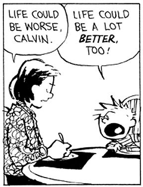
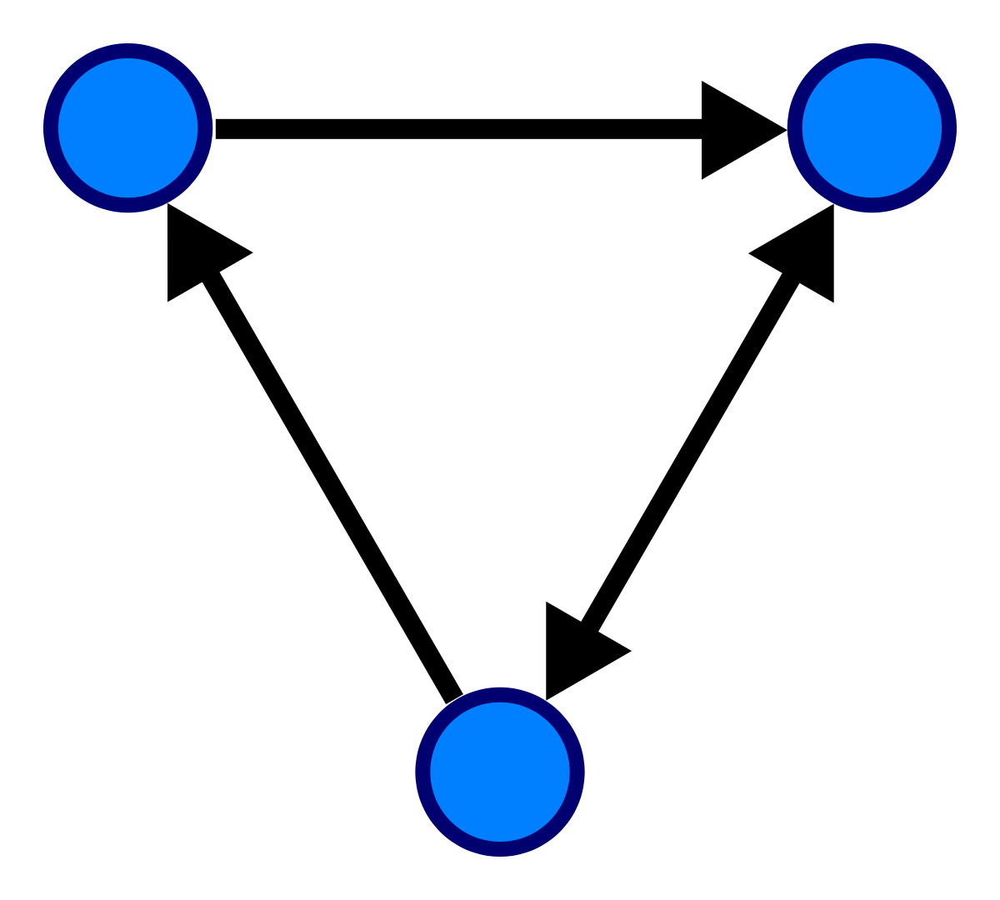
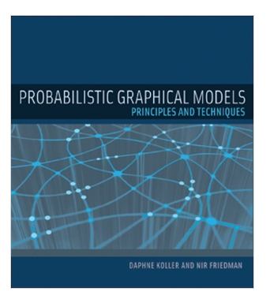
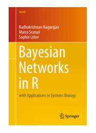
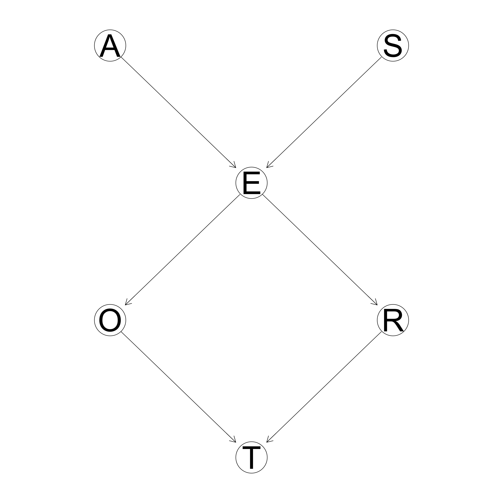
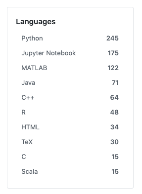

```{r setup, include=FALSE}
knitr::opts_chunk$set(echo = FALSE, 
                      warning = FALSE, message = FALSE, 
                      cache = FALSE, fig.align='center')
library(tidyverse)
```

class: middle

# Outline

- Introduction
- Probabilistic (graphical) models 
  - What are PGMs?
  - Example
- Fitting a PGM
  - In `R`
  - In `python` 
- Resources 
  

---

# Introduction

- Most tasks require a person or a system to *reason* 

- We construct *models* of the system which we would like to reason about
  - Encode our knowledge about the system in a computer-readable form

- Reasoning about what is *probable*

```{r, out.height="30%", out.width="30%", fig.height=5}

```


---

class: center, middle, inverse

##  Probabilistic Graphical Models 

---

class: center, middle, inverse

##  Probabilistic Graphical Models 

## (?)


---

#  $\underbrace{\text{Models}}_{}$ 


- The models represent our understanding of events;  
- Declarative representation:
  - Each model has its own unique assumptions. 
- Can be deterministic (physical models) or involve random elements (statistical models) 

---

# $\underbrace{\text{Probabilistic}}_{}$

- The models can not cover all elements related to the observed data:
  - Variability due to model limitation
  
- Probability accomodates the **uncertainty**:
  - Noisy observations 
  - Model assumptions 

- The world is **inherently** stochastic: 
  - **Everything that involves probability is a model**
  
---

#  $\underbrace{\text{Graphical}}_{}$ 

- Graphs are a computer science tool used in many different areas; 
- Represent complex systems that have many variables; 
- The systems can be a result of the models we assume:
  - thousands or millions of parameters. 
  
```{r, out.height="30%", out.width="30%", fig.height=5}

```


--->  Representation, inference, and learning: critical components in intelligent systems
---

class: middle, center

## Reference books 

.pull-left[
```{r, echo = FALSE, out.width="90%", eval = TRUE}

```
] .pull-right[

```{r, echo = FALSE, out.width="90%", eval = TRUE}

```
]


---

## Example

- We want to investigate the usage patterns of different means of transport


```{r, echo = FALSE, out.width="80%", eval = TRUE}

```


---

## Example


.pull-left[
```{r, echo = FALSE, out.width="80%", eval = TRUE}

```
] .pull-right[

- **Age (A)**: young for individuals < 30 years old, adult for individuals
between 30 and 60 years, and old for people > 60.
- **Sex (S)**: male or female.
- **Education (E)**: up to high school or university degree.
- **Occupation (O)**: employee or self-employed.
- **Residence (R)**: the size of the city, as small or big.
- **Travel (T)**: the means of transport favored by the individual (car, train or other).
]

The **nature of the variables** suggests how they may be related to each other.

---

## Semantics

- A Bayesian Network is a directed acyclic graph (DAG) G whose nodes represent random variables $X_1,\dots,X_p$
- For each node $X_i$, there exists a conditional probability distribution $P(X_i |Par_G(X_i))$ 
- The CPDs will denote the dependencies existing in the graph 

- By the chain rule of probability, we can always represent a joint distribution
as follows, in any order:

$$P(x_1:V) = p(x_1) p(x_2 | x_1) p(x_3 | x_2, x_1) \dots p(x_V | x_{1:V})$$

being $V$ the total number of variables. For the example, we have: 

$$P(A, S, E, O, R, T) = P(A) P(S) P(E| A, S) P(O | E)  P(R | E) P(T | O, R) $$
$$ P(A, S, E, O, R, T) = P(A) P(S) P(E| A, S) P(O, R | E) P(T | O, R)$$


---

## Some CPDs (using the data)

.pull-left[
$$ P(A) = $$
```{r, echo = FALSE, results='asis'}
library(kableExtra)
library(formattable)

da <- read.table("data/survey.txt", header = TRUE)

da %>% 
  janitor::tabyl(A) %>% 
  select(-n) %>% 
  spread(A, percent) %>% 
  knitr::kable(escape = FALSE, format = 'html') %>%
  kable_styling(bootstrap_options = c("condensed", "hover"), 
                full_width = FALSE) %>% 
  column_spec(2, width = "4cm") 
```

$$ P(S) = $$
```{r, echo = FALSE, results='asis'}

da %>% 
  janitor::tabyl(S) %>% 
  select(-n) %>% 
  spread(S, percent) %>% 
  knitr::kable(escape = FALSE, format = 'html') %>%
  kable_styling(bootstrap_options = c("condensed", "hover"), 
                full_width = FALSE) %>% 
  column_spec(2, width = "4cm") 


```


].pull-right[

$$P(E | S,  A) =$$ 

```{r, echo = FALSE, results='asis'}
da %>% 
  group_by(A, S) %>% 
  count(E) %>% 
  mutate(perc =  n/sum(n)) %>% 
  select(-n) %>% 
  reshape2::dcast(S + A ~ E  ) %>% 
  mutate_if(is.numeric, funs(round(., 3))) %>% 
  knitr::kable(escape = FALSE, format = 'html') %>%
  kable_styling(bootstrap_options = c("condensed", "hover"), 
                full_width = FALSE) %>% 
  column_spec(2, width = "4cm") 
```
]


---

## Training the BN in `R` 
- `bnlearn` package 
- We build the network structure first and then pass the data into the fit function

```{r, echo = TRUE}
library(bnlearn)
# Building the graph by hand 
survey.dag = empty.graph(nodes = c("A", "S", "E", "O", "R", "T"))
survey.dag = set.arc(survey.dag, from = "A", to = "E")
survey.dag = set.arc(survey.dag, from = "S", to = "E")
survey.dag = set.arc(survey.dag, from = "E", to = "O")
survey.dag = set.arc(survey.dag, from = "E", to = "R")
survey.dag = set.arc(survey.dag, from = "O", to = "T")
survey.dag = set.arc(survey.dag, from = "R", to = "T")
```

---


## Training the BN in `R` 

```{r, echo = TRUE}
# OR, by model declaration syntax
survey.dag = model2network("[A][S][E|A:S][O|E][R|E][T|O:R]")

skeleton(survey.dag)
```

---

## Training the BN in `R` 

```{r}
set.seed(2019)
da <- read.table("data/survey.txt", header = TRUE) %>% 
  group_by_all() %>% 
  mutate(set = ifelse(runif(n()) > 0.85, "test", "train")) %>% 
  ungroup()

train <- da %>% filter(set == "train") %>%
  select(-set) %>% 
  as.data.frame()

test <- da %>% filter(set == "test") %>% select(-set) %>% 
  as.data.frame()
```

The survey train data:
```{r}
train %>% 
  head(3) %>% 
  knitr::kable()
```

Using the network structure:
```{r, echo = TRUE}
bn.mod <- bn.fit(survey.dag, data = train)
```
 
```{r}
bn.mod$A
```
 
---
 
```{r}
bn.mod$S
```
 

```{r}
bn.mod$E
```

---

```{r}
bn.mod$O
```

```{r}
bn.mod$R
```

---

```{r}
bn.mod$T
```


---
## BN predictions for the test set

```{r, echo = TRUE}
pred <- predict(bn.mod, "T", test) 
scales::percent(sum(pred == test$T)/nrow(test)) # Accuracy
```

## Random Forest comparison
```{r, echo = TRUE}
rf <- randomForest::randomForest(T ~ . , data = train)
scales::percent(sum(predict(rf, test) ==  test$T)/nrow(test)) # Accuracy
```


---

## Training the BN in `python` 
 
 - `pgmpy` package


```{python, engine.path = "/Users/brunawundervald/anaconda3/bin/python3", echo = TRUE}
from pgmpy.models import BayesianModel
from pgmpy.estimators import MaximumLikelihoodEstimator, BayesianEstimator
```

```{python, engine.path = "/Users/brunawundervald/anaconda3/bin/python3", echo = FALSE}
import numpy
import pandas as pd

# da =  pd.read_csv('talk/data/survey.txt', sep=" ", header=0)
#numpy.random.seed(2019)
#rnd = numpy.random.uniform(size = 500)
#da['set'] = numpy.where(rnd > 0.85, "test", "train")
#train = da[da.set == 'train'].drop(labels = 'set',  axis=1)
#test = da[da.set == 'test'].drop(labels = ['set', 'T'],  axis=1)
train =  pd.read_csv('data/train.txt', sep=" ", header=0)
test =  pd.read_csv('data/test.txt', sep=" ", header=0)
```

```{python, engine.path = "/Users/brunawundervald/anaconda3/bin/python3", echo = TRUE}

model = BayesianModel([('A', 'E'), ('S', 'E'), ('E', 'O'), ('E', 'R'),('R', 'T'), ('O', 'T')])
model.fit(train, estimator = MaximumLikelihoodEstimator)
print(model.get_cpds('A'))
```

--- 

---

```{python, engine.path = "/Users/brunawundervald/anaconda3/bin/python3", echo = TRUE}
print(model.get_cpds('T'))
```


```{python, engine.path = "/Users/brunawundervald/anaconda3/bin/python3", echo = TRUE}

## BN predictions for the test set
test_response = test['T'] 
pred = model.predict(test.drop(labels = 'T',  axis=1))

df = pd.DataFrame({'pred' : pred['T'], 'test' : test_response} ) 

'{:.1%}'.format(df[df.pred == df.test].shape[0]/test.shape[0])
```

---

## BN details
  - Way faster algorithm
    - The simplest version just uses the CPDs
  - It can accommodate millions of variables and parameters 


##  Why do we need PGMs?

- Every probabilistic model can be represented as a graph. That includes:
  - Linear and generalized linear models 
  - Probabilistic clustering 
  - Probabilistic PCA
  - Topic Modelling
  - Hierarchical Models 
  - Latent Variable Models in general
  - Markov Chains
  - Bayesian Neural Networks
  - $\infty$

---

class:  middle

## Some real-life examples

- **Medical diagnosis**: which characteristics of a patient influence in the presence of disease?
- **Spam filter**: how likely is an email to be spam given its content?

- **Google Page Rank**: what are the more relevant pages in a Google search? 

- **Recommendation systems (Netflix, Amazon, Facebook)**: which products the clients are more likely to consume?

- **Presidential polls**: in who are the voters more likely to vote for?  


---

# Resources


> https://github.com/search?p=2&q=probabilistic+models&type=Repositories

.pull-left[
```{r, echo = FALSE, out.width="70%", eval = TRUE}

```
] .pull-right[

- `bnlearn`: http://www.bnlearn.com/book-crc/
  - data & tutorials  
- CRAN task `GR`: gRaphical Models in R
  - Representation & Modelling
  - https://cran.r-project.org/web/views/gR.html
  
- `pgmpy` page: http://pgmpy.org/

- many, **many** more packages for both `R` and `python`
]

---
class: center, middle

## Acknowledgments

This work was supported by a Science Foundation Ireland Career Development Award grant number: 17/CDA/4695

```{r, echo=FALSE, fig.align='center', out.height="40%", out.width="50%", fig.height=2, eval = TRUE}
knitr::include_graphics("img/SFI_logo.jpg")
```


---

# References

```{r, echo = FALSE, eval = TRUE, results='asis'}
library(RefManageR)
bibs <- ReadBib("refs.bib", check = FALSE)
print(bibs, 
      .opts = list(check.entries = FALSE, 
                   style = "html", 
                   bib.style = "authoryear"))
```


---
class: bottom, center, inverse

<font size="30">Thanks! </font>

 

<b>

 <color="FFFFFF">  https://github.com/brunaw </color>

